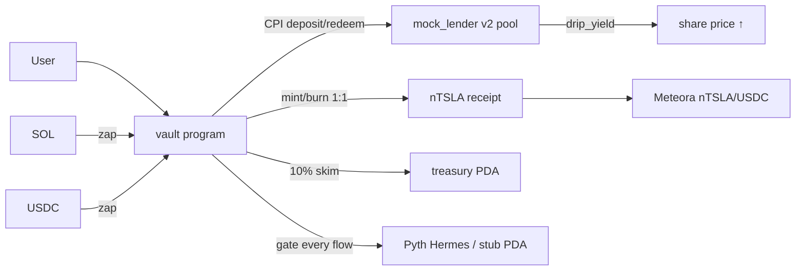

# Nesrt

**One-click yield for tokenized equities on Solana. Deposit TSLAx, earn lending yield, withdraw anytime — no pools to pick, no rates to compare.**

   

---

## 1. Product

A user connects Phantom, gets test TSLAx from the faucet, and puts it to work with one click. The vault routes collateral into an on-chain lending pool, yield accrues to the share price, and the user gets liquid **nTSLA** receipt tokens — withdrawable anytime, or tradable on Meteora without unwinding. Holding SOL or USDC instead? The Zap tab converts and vaults in the same flow.

```
connect Phantom → faucet TSLAx → Vault (or Zap SOL/USDC) → nTSLA minted 1:1 vs pool shares
→ yield accrues → Unvault anytime (principal + 90% of yield, 10% to treasury)
→ or trade nTSLA on Meteora for instant USDC
```

Nesrt is a single-asset yield vault with a Pyth-gated front door and a liquid receipt token. It is not a DEX, not a borrow/lend frontend, and not an investment product — balances here are mock assets for testing.

Product pages: `/` (landing), `/app` (Sanctuary dashboard), `/app/pool` (pool creator + seeder).

## 2. Why it exists

Tokenized equities sit idle in wallets earning 0%. Their holders are typically not DeFi power users — no one should have to compare reserves, monitor LTVs, or manage collateral ratios to earn lending yield. Nesrt absorbs all of that: one deposit, continuous yield, a receipt token that stays composable (Meteora-tradable, burnable for the underlying plus yield).

## 3. How it works

| Step | What happens | Where |
|---|---|---|
| Faucet | Server-signed mint of 100 test TSLAx (SOL airdrop best-effort) | `app/src/app/api/faucet/route.ts` |
| Oracle gate | Every deposit/withdraw validates TSLAx/USD: fresh Hermes update (60s) or admin stub PDA (24h) | `programs/vault/src/lib.rs:require_fresh_tslax_price` |
| Deposit | User TSLAx → vault custody → pool CPI → nTSLA minted 1:1 vs shares | `programs/vault/src/lib.rs:deposit`, `app/src/vault.ts:buildDepositTx` |
| Zap-In | Jupiter v6 quote/swap (atomic bundle or sequential) or devnet faucet-rate mint → auto-deposit | `app/src/components/JupiterZapModal.tsx`, `app/src/app/api/zap/route.ts` |
| Yield | Admin `drip_yield` raises the share price; dashboard shows live `accrued ÷ deposited` | `programs/mock_lender/src/lib.rs:drip_yield`, `app/src/yield.ts` |
| Withdraw | Burn nTSLA → redeem principal + yield → 10% fee to treasury → user paid | `programs/vault/src/lib.rs:withdraw` |
| Trade | nTSLA/USDC DLMM pair, dashboard Trade card | `app/src/app/app/page.tsx:TradeCard` |
| History | Webhook-first event feed with RPC fallback | `app/src/history.ts`, `app/src/app/api/webhooks/helius/route.ts` |

Full design: [`docs/architecture.md`](docs/architecture.md). Requirements + status: [`docs/prd.md`](docs/prd.md). Engineering log: [`docs/handoff.md`](docs/handoff.md). Ops commands: [`docs/runbook.md`](docs/runbook.md).

## 4. Live product

Devnet only. Connect Phantom (Devnet mode) at the app, fund via faucet, Vault any amount:

```bash
cd app && npm install && npm run dev   # http://localhost:3000
```

Live contracts (all verified on-chain, see §5):

| Component | Address |
|---|---|
| Vault program | `DiUKSs93G6wBb5FZCjJ8NhknkaVDQht1yeeCTM8K8yPB` |
| Lending pool (mock v2) | `6TdFhCAHbod21bm7BCenz3fEAgfTQr1BGri7Mzjie9Nx` |
| nTSLA receipt mint | `AMXCrrSXNASso6ANoFsk2zAPUKimGvcCagVfx4Ev5hRA` |
| Treasury PDA | `CEHuKwAgZp4aaynTo1oivCYT7nRGnWVRW9kSGd5MLmM4` |
| Pyth stub PDA | `2cXuUBQRjeDTJMCXVrq17VrS36spJcyXhxP6AE3HfKoZ` |
| Meteora LB pair (nTSLA/USDC) | `3iCpUt4RPQ2gzjAN55w3tuar1Qa4YaH4qqD3LZxJtfUM` |

## 5. Live proof

Every row is a confirmed devnet transaction. No mocks.

| Case | Result | Transaction |
|---|---|---|
| Deposit 2 TSLAx → 2M nTSLA | executed, shares verified | [55xNRf…nxRrj6](https://explorer.solana.com/tx/55xNRf8FNsv95bEcwxWEd51dFmAMKwH5wtoyy5PoveDBWDDoEpJhqZbUU2qYHEsH7CyVqrwxPmHxNMnxRrj6AzX6?cluster=devnet) |
| Drip 0.2 yield → rate 1.05 | executed, APY 5% observed | [2o8v9F…36SDP4](https://explorer.solana.com/tx/2o8v9FZjcfwA2AgYPdFAKhm8ATJBm3gDH2M6RCnDJUgnPtXiipUwLdjStaSFGMFpp5cGj27CbXoMxCKaw36SDP4m?cluster=devnet) |
| Withdraw all → 2.09 user + 0.01 treasury | exact 10% skim, receipt burned | [56nyNZ…MPmSdM](https://explorer.solana.com/tx/56nyNZKtvTRh7mCa9GTx8CsvG6KT2EeFWcCnFtuTaZmsa2kNSHqF1CGcEpsHjAtRnm1T4JaYK5wWNnY7MPmSdMmK?cluster=devnet) |
| Zap 0.02 SOL → 0.2 TSLAx → nTSLA | 400/409 guards verified, exact math | [TNH52D…eMxQ4k](https://explorer.solana.com/tx/TNH52DebxknvJrFsbyavonHuHiGY2usmvJTB6oLgnXNDqhpVGL3jozA7oJyKFy5gmG2PHpSdhTVL8GeMxQ4kosu?cluster=devnet) |
| Meteora pair created (0.25% fee) | account live, owned by DLMM program | [5eyaUV…d4xnep](https://explorer.solana.com/tx/5eyaUV46Rr3aS3gqTB6AfhGNY9pHxX32ajsEx8FuFctebdgrmKrRkgdRw5284mgjV5Tu21MxTXHeuqNHd4xneppM?cluster=devnet) |
| Pool seeded 10 + 10 Spot | position live | [5cAA3q…TMfK2](https://explorer.solana.com/tx/5cAA3qTh556pAZ82NkHFjQanZwZtwjZ6MyuHnzoEooXWEP3sqnUW8q91jtVhNQjeqRMavqrJSKSnHXM2jCvTMfK2?cluster=devnet) |

## 6. Results

- Pool: **30.2 TSLAx deposits**, 0.479 TSLAx accrued yield, rate > 1.0 and climbing with drips.
- Treasury: **0.022056 TSLAx** skimmed across withdrawals — every unit traceable to a 10% fee line.
- Tests: **8/8 Anchor integration tests pass on devnet** (stub post, deposit, zero-reject, drip, gated withdraw + skim, Hermes probe).
- Builds: `cargo build-sbf` clean for both programs; `tsc --noEmit` + `next build` clean.

## 7. Architecture



On-chain: one vault program (14 instructions), one lending program (pool, shares, drip), three PDAs (authority, treasury, stub oracle), ATAs for all custody. Off-chain: Next.js 14 app (dashboard, pool creator/seeder, faucet, zap, pyth-post and helius-webhook routes). CPI callees ride in the outer instruction (Agave `prepare_instruction` requirement — the fixed `Unknown program` saga is documented in [`docs/handoff.md`](docs/handoff.md)).

## 8. Integrations

| Provider | Role | Status |
|---|---|---|
| Mock lender v2 | lending pool behind the vault | live, E2E-verified |
| Pyth (Hermes pull) | TSLAx/USD gate: feed id + 60s + Full verification | code-live, stub-active; Hermes key needed for pull posting |
| Pyth stub oracle | admin-posted devnet price (24h window) | live (`update_stub_price`) |
| Meteora DLMM | nTSLA/USDC secondary liquidity | live pair, seeded 10+10, created + seeded in-app |
| Jupiter v6 | SOL/USDC zap swaps (quote → bundle-or-sequential) | wired, activates where routes exist |
| Helius | Enhanced webhook history feed | endpoint live, delivery needs public URL + key |
| Squads V4 | multisig admin migration | prepared (`set_admin`), transfer pending |

Where each integration lives:

| Provider | What it does | Code |
|---|---|---|
| Pyth | feed-id/staleness gate on deposit + withdraw | [`programs/vault/src/lib.rs`](programs/vault/src/lib.rs) (`require_fresh_tslax_price`) |
| Pyth | VAA fetch → post_update bundle builder (server-side) | [`app/src/app/api/pyth/post/route.ts`](app/src/app/api/pyth/post/route.ts), [`app/src/pyth.ts`](app/src/pyth.ts) |
| Meteora | custom-fee pair creation + Spot seeding for Phantom signing | [`app/src/app/app/pool/page.tsx`](app/src/app/app/pool/page.tsx) |
| Jupiter | v6 quote/swap, atomic-bundle attempt, sequential fallback | [`app/src/components/JupiterZapModal.tsx`](app/src/components/JupiterZapModal.tsx) |
| Helius | Enhanced payload parse, vault filter, 200-event ring | [`app/src/app/api/webhooks/helius/route.ts`](app/src/app/api/webhooks/helius/route.ts) |

## 9. Security

PDA-owned custody everywhere, `invoke_signed` with explicit seeds, `require_keys_eq!` on pool/shares/mint/program accounts, pause flag checked on every flow, admin-only fee/config/oracle updates, payment-verified + replay-guarded zap minting. Programs are **not audited**. [`docs/architecture.md`](docs/architecture.md) has the full model.

## 10. Reproduction

Programs + integration tests (needs `keypairs/nesrt-admin.json`, never committed):

```bash
export PATH="$HOME/.local/share/solana/install/releases/stable-e29e5d910f0c2b7176f58174e592e8488099ef75/solana-release/bin:$PATH"
cargo build-sbf --manifest-path programs/vault/Cargo.toml
export ANCHOR_PROVIDER_URL=https://api.devnet.solana.com ANCHOR_WALLET=$PWD/keypairs/nesrt-admin.json
./node_modules/.bin/ts-mocha -p tsconfig.json -t 1000000 tests/vault.ts
```

Frontend (no keys needed except faucet signer for local dev):

```bash
cd app && npm install && npm run dev      # http://localhost:3000
npm run build && npx tsc --noEmit         # both must be clean
```

Current checks: 8 Anchor tests, `cargo build-sbf` × 2, typecheck, lint and `next build` pass.

## 11. Limitations

Devnet demo, not production. Mock (not Kamino) lending pool. Stub oracle, not Hermes pull (needs API key). No Meteora CPI inside the vault program. Helius delivery needs a public URL. Unaudited contracts. Devnet RPC flakes — the app auto-retries transient failures once. Full list with evidence: [`docs/handoff.md`](docs/handoff.md).

## 12. Repository map

| Path | Contents |
|---|---|
| `programs/vault` | Anchor vault program (deposit/withdraw/fee/gates/admin) |
| `programs/mock_lender` | Anchor lending pool (pool, shares, drip) |
| `app/src/app` | Landing `/`, dashboard `/app`, pool studio `/app/pool`, API routes |
| `app/src/components` | Wallet, toasts, theme, charts, onboarding, zap modal |
| `app/src` | `vault.ts`/`yield.ts`/`history.ts`/`errors.ts`/`pyth.ts`/`config.ts` data layer |
| `scripts` | Pool/custody/admin/devnet-crank helpers |
| `tests` | Anchor integration suite (8 tests, devnet) |
| `docs` | PRD, architecture, handoff, runbook |

## 13. Context

Built on Solana devnet, September 2026. Where this repo and older planning docs differ, the repository reflects what was built and verified.

Licensed under the [MIT License](LICENSE).

TSLAx and nTSLA are mock assets with no value. Nothing here is investment advice.
